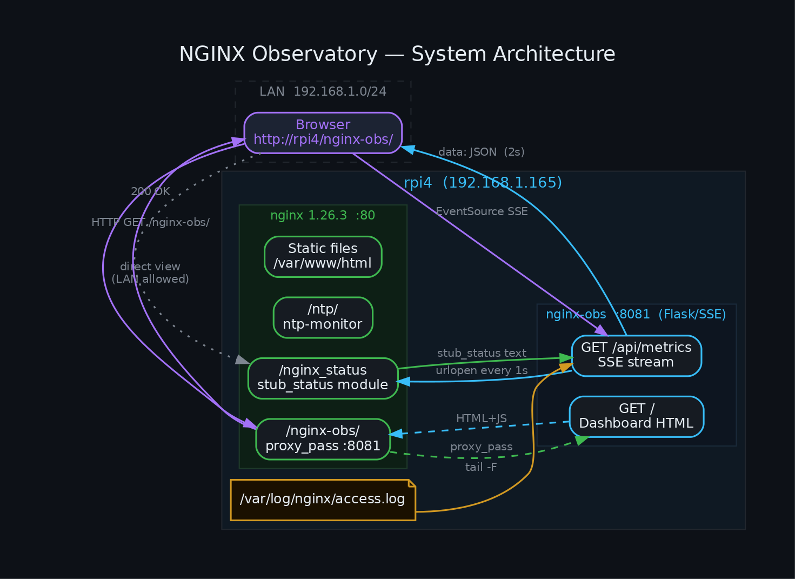
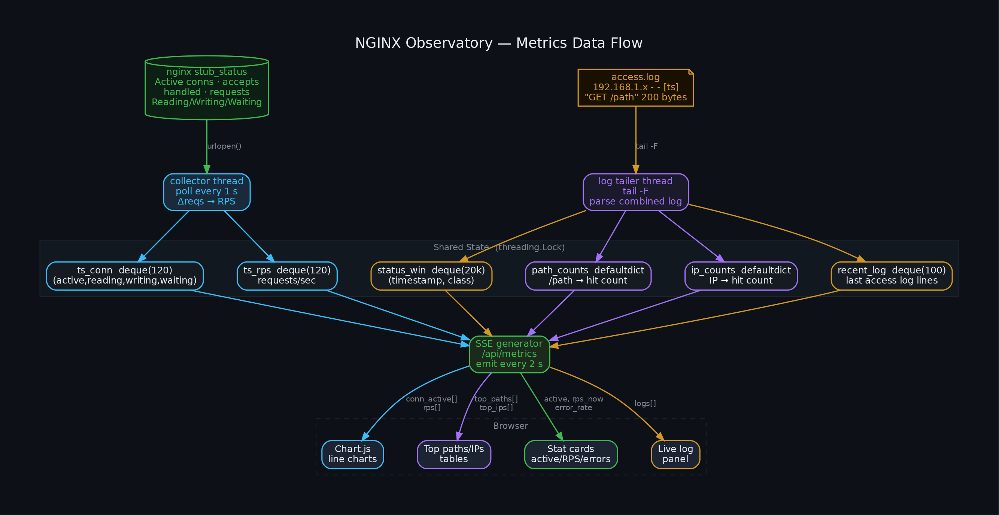
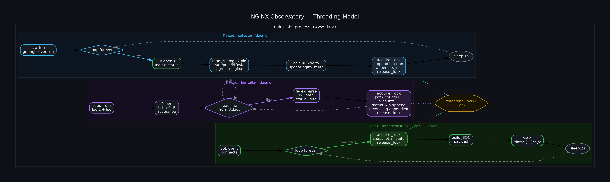
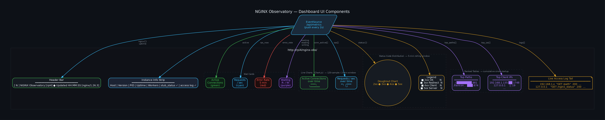
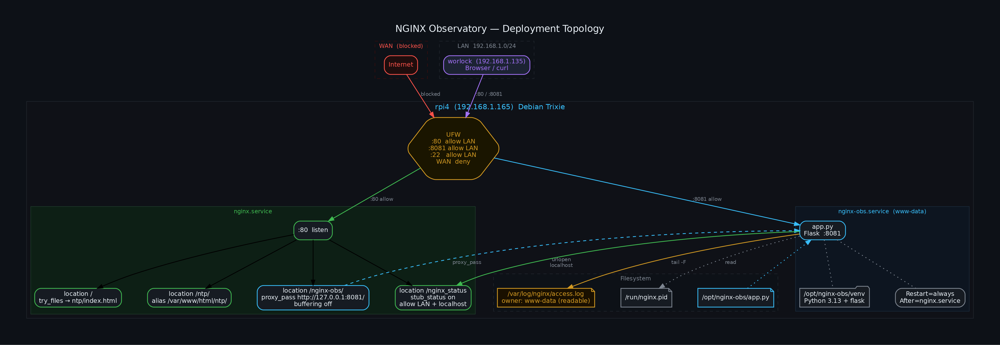

# NGINX Observatory

A self-hosted, real-time observability dashboard for nginx — inspired by F5 NGINX One Console.
Runs entirely on your server. No cloud. No agents. No data leaves your LAN.



## Features

- **Live metrics** pushed via SSE every 2 seconds — no polling from the browser
- **Active connections** with reading / writing / waiting breakdown
- **Requests per second** delta, sampled every 1 s
- **Error rate** (4xx + 5xx) over a 5-minute rolling window
- **Status code distribution** — doughnut chart, 5-min window
- **Top paths and top client IPs** — ranked tables with relative-frequency bars
- **Live access log tail** — last 25 entries, colorized by status class
- **Instance info strip** — nginx version, master PID, uptime, worker count
- Dark theme, neon accents — readable on any monitor

## Screenshots / Diagrams

| Diagram | Description |
|---------|-------------|
|  | System architecture |
|  | Metrics data flow |
|  | Threading model |
|  | Dashboard UI components |
|  | Deployment topology |

## Requirements

- Linux host with **nginx** compiled with `--with-http_stub_status_module`
  (all standard Debian/Ubuntu/RHEL nginx packages include this)
- **Python 3.9+** with `venv`
- `tail` (coreutils)
- Optional: `systemd`, `ufw`

## Quick Start

```bash
# Clone
git clone https://github.com/danindiana/nginx-obs
cd nginx-obs

# Run the setup wizard (handles everything below automatically)
chmod +x setup.sh
sudo ./setup.sh
```

Then open **http://\<your-server\>/nginx-obs/** in a browser.

## Manual Installation

See [SETUP.md](SETUP.md) for the full step-by-step guide.

## Configuration

All config is at the top of `app.py`:

| Variable | Default | Description |
|----------|---------|-------------|
| `NGINX_STATUS` | `http://127.0.0.1/nginx_status` | stub_status URL |
| `ACCESS_LOG` | `/var/log/nginx/access.log` | Log file to tail |
| `HISTORY_LEN` | `120` | Time-series samples (1 sample/sec → 2-min window) |
| `BIND_HOST` | `0.0.0.0` | Flask listen address |
| `BIND_PORT` | `8081` | Flask listen port |

## How It Works

nginx-obs has three concurrent threads sharing a single `threading.Lock()`:

1. **`_collector`** — polls `/nginx_status` every 1 s, computes RPS delta, appends to
   fixed-length deques (`ts_conn`, `ts_rps`)
2. **`_log_tailer`** — seeds from `access.log.1` + `access.log` on startup, then
   runs `tail -F` to track new entries in real time; updates path/IP counters and the
   5-minute status-code window
3. **Flask SSE generator** (`/api/metrics`) — acquires the lock, snapshots all state,
   serializes to JSON, and yields a `text/event-stream` event every 2 s per connected client

The browser uses the native `EventSource` API to consume the stream and drives
Chart.js charts and DOM updates directly — no WebSocket, no framework.

See the diagrams above for a visual walk-through.

## nginx Config

The setup wizard adds this to your server block:

```nginx
# stub_status — readable by localhost + your LAN
location /nginx_status {
    stub_status on;
    allow 127.0.0.1;
    allow ::1;
    allow 192.168.1.0/24;   # adjust to your LAN
    deny all;
}

# Observatory GUI — proxy to Flask on :8081
location /nginx-obs/ {
    proxy_pass http://127.0.0.1:8081/;
    proxy_http_version 1.1;
    proxy_set_header Host $host;
    proxy_set_header X-Real-IP $remote_addr;
    proxy_buffering off;
    proxy_cache off;
    proxy_read_timeout 3600s;
}
```

## Systemd Service

```
/etc/systemd/system/nginx-obs.service
```

Runs as `www-data` (has read access to the nginx access log).
Auto-restarts on failure. Starts after `nginx.service`.

## Security Notes

- The Flask app binds to `0.0.0.0:8081` — restrict with UFW or a firewall rule
  if you don't want it directly reachable (the nginx proxy on :80 is sufficient for LAN use)
- `/nginx_status` is restricted to `localhost` + your LAN CIDR by default
- No authentication is included — add nginx `auth_basic` if exposing beyond your LAN

## License

MIT
